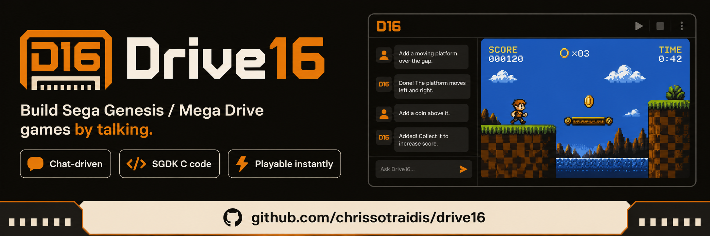

<p align="center">
  
</p>

# Drive16

**Build Sega Genesis / Mega Drive games by talking.**

Drive16 is an open-source desktop app: a conversation on the left, your game
running on the right. You describe what you want in plain language; an agent
writes the SGDK C code, generates sprites and music if you ask, compiles the
ROM, checks the result in an emulator, fixes its own mistakes, and the app
plays the finished ROM immediately — with sound, keyboard, and gamepad.

```text
You:      make a sprite I can move around, with upbeat music
Drive16:  (writes C, composes an FM song, builds, verifies)  →  the game
          appears on the right, playable
```

## Current status (2026-07-09)

The desktop shell and local tool loop are real, but the builder is still in a
reliability/playability hardening phase. A ROM existing is not treated as proof
that the generated game is good or playable.

| Capability | Status |
|---|---|
| Desktop chat → OpenCode agent → active SGDK project | Working, still being hardened |
| First-run workspace | Working: one describe-game action, four proven examples, and an open-project route replace the empty ROM canvas |
| Agent startup | Defaults to local OpenCode; falls back to a Drive16-owned port if another local tool owns 4096, and restarts only the process Drive16 owns |
| Project lifecycle: New / Save / Open / Import ROM / Export ROM / Verify | Working, with no-ROM/stale-ROM guards |
| Interactive play: keyboard + gamepad, pause/reset/stop, fullscreen | Working |
| Audio in the player | Working with safe default volume: ROM playback starts muted/0% |
| Original music through MML | Tooling works; chat-built games must still prove it was wired and captured |
| AI sprites through ComfyUI | Tooling exists; Settings can check/launch local ComfyUI, but the agent must disclose fallback art when unavailable |
| Asset and sound disclosure | In progress: `ASSETS.md` is the role ledger and the project menu previews its rows |
| Playability verification | Working for the primitive/fallback audit: screen, input, restart, audio, genre, freshness, and project-memory evidence are required |
| Live game-quality audit | Complete for DeepSeek V3.1 primitive/fallback runs across Snake, Pong, Tetris, and Asteroids |
| Model bakeoff | Pending; live-audit plumbing is green, but first-run UX and generated-game quality are being raised before comparison |
| Ollama as the agent brain | Planned (readiness check only) |
| Distributable .app/.dmg (currently runs from the repo checkout) | Planned (packaging track) |
| LICENSE file | Pending owner confirmation (MIT proposed) |

Recent history: the app was overhauled on 2026-07-05 — the agent loop was
wired for real (previously only one hardcoded prompt built anything), the UI
was rebuilt into a clean two-pane shell, player audio was added, and the
desktop app now has exactly one chat path: the build agent, with honest
errors. Details: `docs/overhaul-plan.md` (the audit and plan) and
`WORKLOG.md` (what happened, iteration by iteration).

## How it works

Four swappable layers (full detail in `drive16-architecture.md`):

```text
App shell (Tauri 2 + React)          — two-pane UI, player, project actions
  └── Agent spine (OpenCode, local)  — the agent loop, spawned on a local Drive16-owned port
        └── Model (BYOK config)      — OpenRouter today; Ollama planned
        └── MCP tool servers         — the agent's hands:
              drive16-sgdk-build     — compile C + assets → rom.bin (Docker)
              drive16-emulator       — run ROM, screenshot, input, audio dump
              drive16-rag            — Genesis/SGDK reference retrieval
              drive16-mml-music      — MML → VGM compiler (ctrmml)
              drive16-comfyui        — local Stable Diffusion sprite pipeline
```

The agent's instructions live in `agent/skills/drive16-app-builder.md`
(registered via `opencode.json`). It knows the project layout, the Genesis
hardware rules, both asset-generation recipes, and that it must never claim
success without building.

Two emulators, two jobs: **Genteel** (MIT, patched for frame streaming) does
deterministic headless verification; **Nostalgist/RetroArch** (WASM) powers
interactive play in the app.

## Your game is just a folder

Everything the agent builds lives in one ordinary SGDK project —
`artifacts/phase3/active-project/`:

```text
src/main.c        # game code
res/              # ALL assets as plain files
  resources.res   #   one line per asset (SPRITE / XGM declarations)
  *.png  *.vgm    #   sprites and music, generated or bundled
out/rom.bin       # the built ROM — nothing more than a compile of this folder
```

Generated sprites and songs are staged in scratch space, validated, then
copied into `res/` and registered in `resources.res`. You can open the folder
in any editor, build it by hand (`scripts/build-sgdk.sh <path>`), or export
the ROM to share. `ASSETS.md` records which roles used primitive drawing,
bundled files, ComfyUI PNGs, MML music, or SFX; the project menu previews that
ledger and shows thumbnails for repo-local PNG rows so asset use is visible
without opening markdown. Save/Open snapshots live in
`artifacts/phase3/projects/`.
Full contract: **`docs/project-structure.md`**.

## Quickstart

Requirements (macOS today; the toolchain itself is cross-platform):

- Docker Desktop (runs the SGDK compiler image — no local cross-compiler)
- Node 22+ and pnpm, Rust + Cargo
- [OpenCode CLI](https://opencode.ai) (`opencode` on PATH — the agent spine)
- An OpenRouter API key (BYOK; any strong model — default is
  `deepseek/deepseek-chat-v3.1`)

```sh
pnpm --dir app install

# Browser preview (limited: no agent bridge)
pnpm --dir app dev            # → http://127.0.0.1:1420/

# The real app (macOS debug bundle, rebuilds then opens)
scripts/launch-drive16-native.sh
```

First run, in the app:

1. Start Docker Desktop.
2. Settings → paste your OpenRouter key → **Test OpenRouter** (one time —
   the key is stored in OpenCode's local auth store, never in the repo).
3. Type what you want to build. Watch the right pane.

If something is missing (Docker down, no key), the agent tells you in one
plain sentence, and Settings → Setup shows a live checklist.

## Optional: AI sprite generation (local diffusion)

Sprites are generated by a local ComfyUI with a tuned Genesis workflow
(SDXL + Pixel Art XL LoRA + 16-color quantizer, downscaled to 32x32 and
validated against hardware rules). One-time setup:

```sh
# install the two model files after reviewing their licenses
scripts/install-phase4-comfyui-models.sh --accept-model-licenses --check

# start the local ComfyUI API (or use Settings → AI sprites → Launch)
scripts/launch-phase4-comfyui-api.sh
```

Then enable **AI sprites** in Settings and just ask the agent ("give the
player a spaceship sprite"). Generation can also be driven directly:

```sh
python3 scripts/run-comfyui-sprite-workflow.py --prompt "a small green alien spaceship" --symbol my_ship
```

Music generation needs no setup: the ctrmml compiler is fetched and built
automatically on first use, entirely locally.

## Verifying the build (for developers)

```sh
pnpm --dir app build                          # typecheck + bundle
pnpm --dir app check:live-game-audit-readiness # writes primitive/fallback vs generated-sprite audit readiness
pnpm --dir app prepare:live-game-audit        # refreshes readiness, then writes report.json
pnpm --dir app prepare:live-game-audit:prompt # prepares one Snake/Pong/Tetris/Asteroids run packet
pnpm --dir app run:live-game-audit:prompt -- --prompt snake-basic --model openrouter/<model>
pnpm --dir app promote:live-game-audit -- --run snake-basic=<run-id> --run pong-basic=<run-id> --run tetris-basic=<run-id> --run asteroids-basic=<run-id>
pnpm --dir app verify:opencode-audio-trace    # self-test audio trace guard for generated-game audits
pnpm --dir app verify:live-game-audit         # self-test the next live game-quality audit gate
pnpm --dir app verify:live-game-audit:report  # fails until all live prompt runs have evidence files
pnpm --dir app prepare:model-bakeoff          # requires the completed live audit report first
pnpm --dir app verify:model-bakeoff:report    # fails until all model/prompt evidence files exist
cargo test --manifest-path app/src-tauri/Cargo.toml   # native tests
node scripts/verify-phase6-browser-smoke.mjs  # Playwright UI smoke (dev server must run)
scripts/verify-phase6-loop.sh --browser       # full loop harness
```

The deterministic proof path (build → run in Genteel → verify sprite
movement and non-silent audio) is available in-app via the project menu's
**Verify**, or from the CLI with `scripts/validate-phase4-live-generated-assets.sh`.

## Repository map

```text
app/                  Tauri 2 + React desktop app
  src/App.tsx           state owner + routing
  src/components/       TopBar, ChatRail, PlayerPane, SettingsPanel, ProjectMenu
  src/agent/            OpenCode session client, OpenRouter fallback (browser)
  src/player/           Nostalgist adapter, input profiles, core readiness
  src-tauri/src/        Rust: opencode bridge, project/ROM/asset commands,
                        Genteel runner, preflight, ComfyUI/Ollama checks
agent/skills/         the builder agent's instructions
mcp-servers/          sgdk-build, emulator, mml-music (Python, stdio MCP)
corpus/               Genesis/SGDK reference corpus for RAG
assets/core/          bundled sprite + music loop (proven CC-clean pack)
assets/enhancements/  ComfyUI workflow contract, MML FM presets
examples/             app-starter-blank (the project template)
scripts/              build/launch/validation tooling
docs/                 living docs + per-phase evidence archive
patches/              Genteel frame-streaming patch
```

Key documents:

- `docs/overhaul-plan.md` — the 2026-07-05 audit and the five-track plan
- `docs/project-structure.md` — how a game lives on disk
- `PROGRESS.md` — current ledger; `WORKLOG.md` — iteration journal
- `DECISIONS.md` — recorded decisions (license proposal, emulator choices)
- `drive16-architecture.md` — full architecture reference
- `docs/phase*-*.md` — historical evidence packets from phases 0–8

## Model stance

Bring-your-own-key or local-only. OpenRouter is the hosted default; direct
provider keys can be configured; Ollama is planned for the agent brain. No
Drive16 flow asks you to log into a consumer AI subscription.

## Asset and license hygiene

No commercial ROMs, no disassemblies, no API keys, no model weights, and no
build artifacts in git. Copyleft components (ComfyUI, ctrmml, BlastEm if
used) run as separate processes and are never linked into the app binary.
Genteel (MIT) is the verification emulator. The app code is intended to be
MIT; the LICENSE file lands once the owner confirms (`DECISIONS.md`).

## Roadmap

1. **Packaging** — move storage out of the repo checkout to app-data dirs,
   enable Tauri bundling, ship a signed .dmg (overhaul plan, Track E).
2. **Multi-project workspaces** — named projects you can switch between,
   beyond the single active workspace + snapshots.
3. **Ollama as the agent brain** — fully local, keyless building.
4. **Play-core policy** — bundle or fetch a licensed Genesis core instead of
   the development CDN fallback.
5. **LICENSE + CSP + release hardening.**
