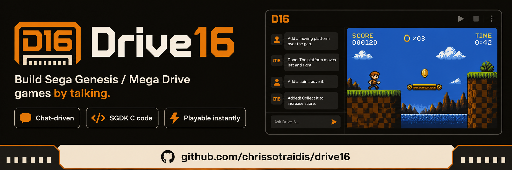
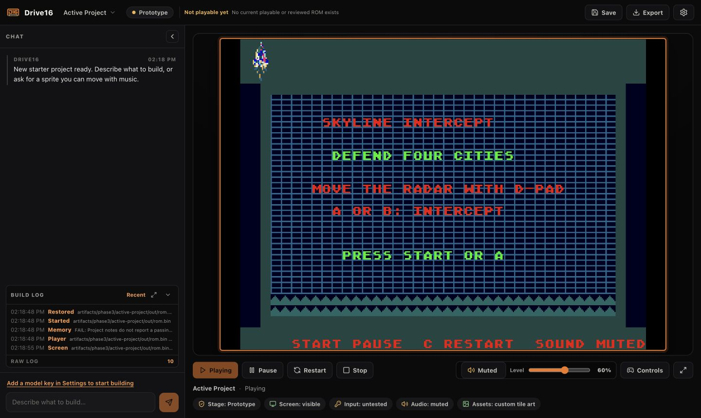

<p align="center">
  
</p>

<h1 align="center">Drive16</h1>

<p align="center">
  <strong>Build Sega Genesis / Mega Drive games by talking.</strong><br>
  Describe a game in plain language. An agent writes SGDK C, makes sprites and FM music, compiles a real ROM, and checks it in an emulator before the game appears beside the chat.
</p>

<p align="center">
  
  
  
  
  
  <a href="LICENSE"></a>
  
  <a href="https://discord.gg/xwHfUD2bxW"></a>
</p>

<p align="center">
  <a href="#quickstart">Quickstart</a> ·
  <a href="#current-status">Current status</a> ·
  <a href="#how-it-works">How it works</a> ·
  <a href="#faq">FAQ</a> ·
  <a href="#community-and-support">Get help</a>
</p>

> [!IMPORTANT]
> **Drive16 is a developer preview you run from source.** There is no published
> download yet. The macOS `.app`/`.dmg` build passes install and Verify checks,
> but interactive Play renders a black canvas in the packaged app, so treat it
> as a test build. Play works in the browser development surface.
>
> Drive16 never treats "a ROM exists" as "the game is good". Every build carries
> a stage (**Prototype → Built → Playable → Reviewed**) backed by screen, input,
> restart, and audio evidence. Today's generated games build and run, but they
> are measurably far below the feel of real Genesis games; closing that gap is
> the current work (see [Roadmap](#roadmap)).



*A game Drive16 built from a chat prompt, running in the app's player. The chips under the screen show what has actually been proven about it.*

## What it does

```text
You:      make a sprite I can move around, with upbeat music
Drive16:  writes C, composes an FM song, builds, verifies  →  the game
          appears on the right, playable
```

- **Chat on the left, game on the right.** Follow-up prompts edit the same project; they never wipe it.
- **Real hardware rules.** Output is ordinary SGDK C and resources that compile to a standard Genesis ROM.
- **Original assets.** Optional local AI sprites (ComfyUI) and MML-composed FM music; every asset role is disclosed in `ASSETS.md`.
- **Honest verification.** A deterministic emulator run checks the screen, input, restart, and audio before Drive16 calls anything playable. If a bounded repair pass cannot fix a failure, the app reports the blocker.
- **Your game is just a folder.** Open it in any editor, rebuild it by hand, or export the ROM.

## Current status

Last updated from `PROGRESS.md` and `docs/2026-07-17-handoff.md`.

| Area | Status |
|---|---|
| Chat → agent → SGDK project → ROM | Working. Phased pipeline (implement → art → music → polish) with deterministic gates |
| Follow-up edits | Working. Intent classifier keeps follow-ups on the active project; in-app iteration measured at under two minutes |
| Build speed and safety | Prompt overhead cut from 57.5k to 18.8k tokens; activity-based watchdog; toolchains pre-warm |
| Interactive Play | Working in the browser surface (keyboard and gamepad, pause, restart, fullscreen). **Black canvas in the packaged macOS app** |
| Audio | Working. Playback starts muted; ROM audio signal is checked separately from browser playback |
| AI sprites (ComfyUI) | Working locally and optional; the app starts ComfyUI when enabled and discloses any fallback art |
| Original music (MML) | Working. Genre template library; compiler is fetched and built locally on first use |
| Local models (Ollama) | First-class build provider; each run verifies the model can drive the build tools |
| Game feel | **Below the bar.** Measured against Sonic 1, Streets of Rage, and Shining Force, generated games show far less motion and animation ([details](docs/genesis-feel-bar.md)) |
| Distribution | Ad-hoc-signed `.app`/`.dmg` builds locally; not published, not notarized |

## Quickstart

**You need:** macOS, [Docker Desktop](https://www.docker.com/products/docker-desktop/) (runs the SGDK compiler), Node 22+, pnpm 10, Rust and Cargo, the [OpenCode CLI](https://opencode.ai) on your `PATH`, and either an OpenRouter API key or a local Ollama model.

```sh
git clone https://github.com/chrissotraidis/drive16.git
cd drive16
pnpm --dir app install

# Browser development surface (Play works here today)
pnpm --dir app dev                 # → http://127.0.0.1:1420/

# Native macOS debug app (rebuilds, then opens)
scripts/launch-drive16-native.sh
```

Then, in the app:

1. Start Docker Desktop.
2. Open **Settings**, pick **OpenRouter** (default model DeepSeek V3.1) or a tested **Ollama** model, and test the connection.
3. Describe a game, or start from one of the four examples (Snake, Pong, Tetris, Asteroids).

If something is missing, the chat tells you in one plain sentence and Settings shows a live setup checklist.

## How it works

Four swappable layers. Full detail lives in [drive16-architecture.md](drive16-architecture.md).

```text
App shell (Tauri 2 + React)        chat, player, project actions
  └── Agent spine (OpenCode)       the agent loop, on a Drive16-owned local port
        ├── Model                  OpenRouter (BYOK) or local Ollama
        └── MCP tool servers       the agent's hands
              drive16-sgdk-build   compile C + assets → rom.bin (Docker)
              drive16-emulator     run ROM, screenshot, input, audio dump
              drive16-rag          Genesis/SGDK reference retrieval
              drive16-mml-music    MML → VGM compiler (ctrmml)
              drive16-comfyui      local pixel-art sprite pipeline
```

Two emulators, two jobs: **Genteel** (MIT, patched for frame streaming) does deterministic headless verification, and **Nostalgist / RetroArch** (WebAssembly) powers interactive play. The agent's instructions live in [agent/skills/drive16-app-builder.md](agent/skills/drive16-app-builder.md).

### Your game is just a folder

Everything lives in one ordinary SGDK project at `artifacts/phase3/active-project/`:

```text
src/main.c        game code
res/              all assets as plain files (resources.res, *.png, *.vgm)
GAME.md           what the game is and how it plays
ASSETS.md         which roles use generated, bundled, or primitive art and sound
PLAYTEST.md       the evidence behind the project's stage
out/rom.bin       the built ROM
```

Build it by hand with `scripts/build-sgdk.sh <path>`. Save/Open snapshots live in `artifacts/phase3/projects/`. Full contract: [docs/project-structure.md](docs/project-structure.md).

## FAQ

<details>
<summary><strong>Can I download Drive16 and just run it?</strong></summary>

Not yet. Run it from source with the Quickstart above. A local `.dmg` can be built with `pnpm --dir app release:macos`, but interactive Play is black in the packaged app, so it is not published. It is ad-hoc signed, so a downloaded copy may need **Open Anyway** in macOS Privacy & Security.
</details>

<details>
<summary><strong>Do the games run on real hardware?</strong></summary>

The output is a standard Genesis ROM compiled by SGDK, so it can be loaded by flash carts and emulators. Drive16's own checks run in emulators (Genteel and RetroArch's Genesis Plus GX); real-hardware testing is not part of the verified path yet.
</details>

<details>
<summary><strong>Which model should I use?</strong></summary>

OpenRouter with DeepSeek V3.1 is the operational default. A tested local Ollama model can build entirely on your machine. Either way, Drive16 checks that the model can actually call the build tools before trusting its results. No flow asks you to log into a consumer AI subscription.
</details>

<details>
<summary><strong>Tips for running local models with Ollama</strong></summary>

- **Bound the context window** at the server, since the OpenAI-compatible API ignores per-request `num_ctx`: `OLLAMA_CONTEXT_LENGTH=49152 ollama serve`.
- **One model instance, one job.** Interleaved requests evict the build's prompt cache and can add minutes to the next step.
- **Pick a tool-calling model.** Drive16 reports models that cannot drive the build tools instead of producing nothing.
- **Browser dev only:** restart `opencode serve` (port 4096) after changing `opencode.json`. The packaged app starts a fresh server each launch.
</details>

<details>
<summary><strong>How do I turn on AI sprites?</strong></summary>

Sprites come from a local ComfyUI workflow (SDXL + Pixel Art XL LoRA + a 16-color quantizer, validated against Genesis rules). One-time setup, after reviewing the model licenses:

```sh
scripts/install-phase4-comfyui-models.sh --accept-model-licenses --check
```

Then enable **AI sprites** in Settings. The desktop app starts ComfyUI for you; the browser surface can use an already running one.
</details>

<details>
<summary><strong>What does "Prototype / Built / Playable / Reviewed" mean?</strong></summary>

- **Prototype:** source exists, but nothing about the ROM has been awarded yet.
- **Built:** a current ROM compiled from the current source.
- **Playable:** the semantic playability gate passed (screen, intended input, restart, audio, genre rules).
- **Reviewed:** a visible quality review also passed.

If the source is newer than the ROM, Drive16 shows **Needs rebuild** and offers a plain rebuild that compiles the files as they are.
</details>

<details>
<summary><strong>Can I use commercial ROMs as references?</strong></summary>

Drive16 can profile how a user-supplied or permissively licensed ROM behaves (motion, animation, audio) to set quality targets. It never extracts assets or uses ROMs as training data, and no ROMs are included in the repository.

```sh
python3 scripts/profile-reference-rom.py path/to/reference.bin --label my-reference
```
</details>

## Roadmap

The current plan is [docs/2026-07-17-p2-plan.md](docs/2026-07-17-p2-plan.md): close the gap between generated games and real Genesis feel.

1. **Game-feel library** in the starter project (per-pixel physics, SFX timing, animation), with genre skeletons rebuilt on it so the model composes rather than invents.
2. **Feel gates and self-play scoring** against the measured [Genesis feel bar](docs/genesis-feel-bar.md).
3. **Art polish** to the bar, with sprite candidate ranking.
4. **Phased builds in the app UI.**
5. **Packaged Play** that renders in the macOS app the same way it does in the browser.

## For developers

<details>
<summary><strong>Checks to run after changing the app</strong></summary>

```sh
pnpm --dir app build                     # typecheck + bundle
pnpm --dir app verify:agent-contract     # agent prompt and event contract
pnpm --dir app verify:prompt-intent      # follow-up vs new-game classifier
pnpm --dir app verify:agent-watchdog     # activity-based watchdog
pnpm --dir app verify:project-memory     # playability, audio, and asset gates
cargo test --manifest-path app/src-tauri/Cargo.toml
node scripts/verify-phase6-browser-smoke.mjs   # Playwright UI smoke (dev server running)
```

Deeper audits (live game audit, model bakeoff, presentation baseline, macOS release verification) are listed in [app/package.json](app/package.json).
</details>

<details>
<summary><strong>Repository map</strong></summary>

```text
app/                  Tauri 2 + React desktop app
  src/App.tsx           state owner and routing
  src/components/       TopBar, ChatRail, PlayerPane, SettingsPanel, ProjectMenu
  src/agent/            OpenCode session client, watchdog, prompt intent
  src/player/           Nostalgist adapter, input profiles, core readiness
  src-tauri/src/        Rust: OpenCode bridge, project/ROM commands, Genteel runner
agent/skills/         the builder agent's instructions
mcp-servers/          sgdk-build, emulator, mml-music, comfyui (Python, stdio MCP)
corpus/               Genesis/SGDK reference corpus for retrieval
assets/               bundled CC-clean sprite and music pack, ComfyUI and MML presets
examples/             app-starter-blank, the project template
scripts/              build, launch, profiling, and verification tooling
docs/                 living docs and per-phase evidence
```

Key documents: [docs/2026-07-17-handoff.md](docs/2026-07-17-handoff.md) (where things stand), [docs/DESIGN.md](docs/DESIGN.md) (UI design thesis), [PROGRESS.md](PROGRESS.md), [WORKLOG.md](WORKLOG.md), and [DECISIONS.md](DECISIONS.md).
</details>

## Licensing and asset hygiene

Drive16's code is released under the [MIT license](LICENSE). The repository contains no commercial ROMs, disassemblies, API keys, model weights, or build artifacts. Copyleft tools (ComfyUI, ctrmml) run as separate processes and are never linked into the app.

The streamed interactive core, Genesis Plus GX, is not bundled and carries a non-commercial license, so this Play path is for free, non-commercial use. Sega, Genesis, and Mega Drive are trademarks of Sega; Drive16 is not affiliated with or endorsed by Sega.

## Community and support

Questions, bug reports, and games you made are welcome in the shared [Discord](https://discord.gg/xwHfUD2bxW), the same community as KartPad and the other ports. For reproducible bugs, open a [GitHub issue](https://github.com/chrissotraidis/drive16/issues) with the prompt you used and the build log.

- Discord: https://discord.gg/xwHfUD2bxW
- Issues: https://github.com/chrissotraidis/drive16/issues
